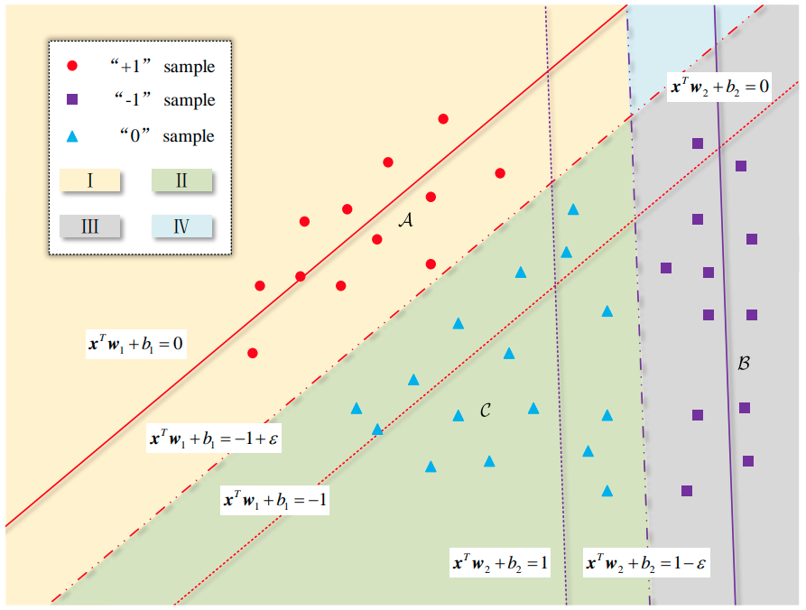
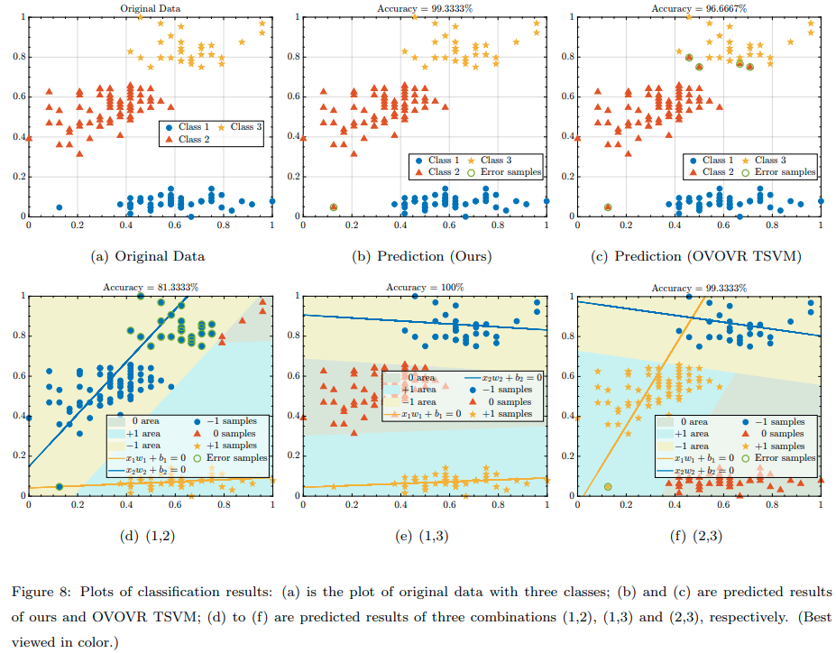

# Solution Path Algorithm for Twin Multi-class Support Vector Machine

The code is available in this repository and can be run with Matlab. 

# Overview

This work proposes a fast regularization parameter tuning algorithm for the twin multi-class support vector machine. It adopts a novel sample data set partition strategy and solves the Lagrangian multipliers piecewise linearly w.r.t. regularization parameters. An effective initialization algorithm is also devised, and eight events are defined for the next iteration. Experimental results show comparable classification performance without solving any quadratic programming problem.

[Paper address](https://arxiv.org/abs/2006.00276v2)

# Qualitative experiments 

The proposed algorithm is intuitively verified using a handcrafted data set containing 3 classes with two-dimensional features. Three combinations are evaluated, and the corresponding results are shown in Figures 8(d) to 8(f), where the samples in the three classes are marked with different colors and two non-parallel lines are shown in different colors.

# Contact

Feel free to contact me with `zhoukanglei[at]qq.com`